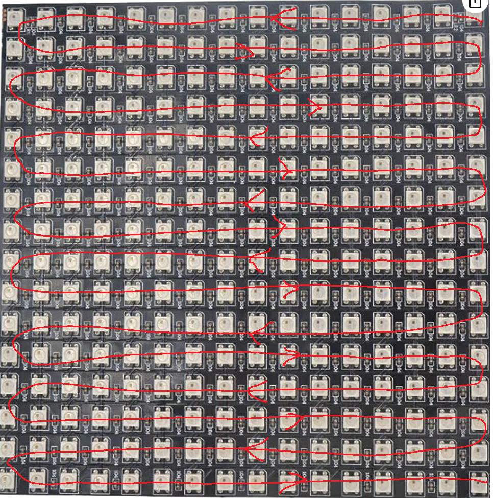
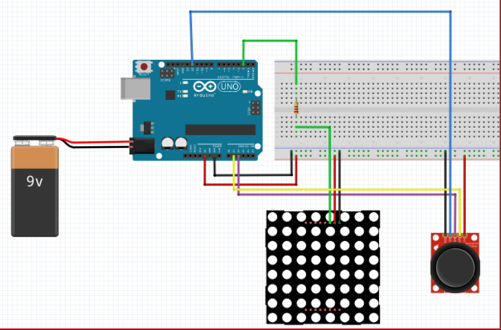

# Arduino Snake Game

## About
    This is a variation of the classic snake game that uses an arduino to 
    control a 16x16 LED matrix. 

    Just like the classic game, the goal is to eat as many apples as you
    can. Each time you eat an apple, your snake length increases. If you
    run into yourself the game is over.

## How it Works
    This project uses Arduino to take input from a joystick and translate
    the input into snake movement on the LED matrix. I used an arduino 
    uno, but arduino nanos, micros, etc aswell as other  microcontrollers 
    will work too. 

    If you do choose to use a different microcontroller, be mindful of the
    pinouts as well as the powersource of the LED matrix.

    The matrix that I used was a 16x16 neopixal led matrix.
    

    

    

Link to the Adafruit site:  [Adafruit Site](https://www.adafruit.com/product/2547)

    Note: You can get these off amazon for pretty cheap, but the 
    Adafruit site has the power rating info for the leds.

    These Led Matrix are configured in a zigzag pattern, so it is 
    essentially one long led strip that is zigzagged to create the 
    matrix. 

    Hopefully this expert image analysis helps out. If you look at the 
    code you can tell there is a little math that goes into finding the
    led array value from a matrix.

    Note: I directly translated the snakes movement as a 1d array. You
    could also use 2d coordinated and then translate it into 1d array to be
    passed into the matrix function. Or maybe there is a library that takes
    x and y coordinates--idk.

    The code takes the direction of the Analog Joystick and translates 
    it into a 4 cases( 1 Up, 2 Down, 3 Left, 4 Right).

    It then moves the snake based on the row and column value -- because
    remeber, the matrix zigzags, so depending on even or odd rows, the snake 
    needs to be translated differently. 

    There are also seperate calculations to translate the snake from one
    side of the matrix to the other, kinda like pacman.

    The wiring is pretty straight forward. The matrix has a VIN for voltage of 
    5V. The arduinos 5V is enough for this project -- if you are using all the 
    leds at the same time you will have more power draw so you will need 
    powersupply with larger amprage.

## Pinouts

    Matrix--> Arduino 

        VIN -- 5V
        GND -- GND
        DIN -- 12

    Joystick --> Arduino

        VIN -- 5V
        GND -- GND
        X Pin -- A3
        Y Pin -- A4
        SWITCH -- 11
    
    Again you can change the pinouts in the code. I don't think the wiring schematic
    is the same as the pinouts I just listed.

